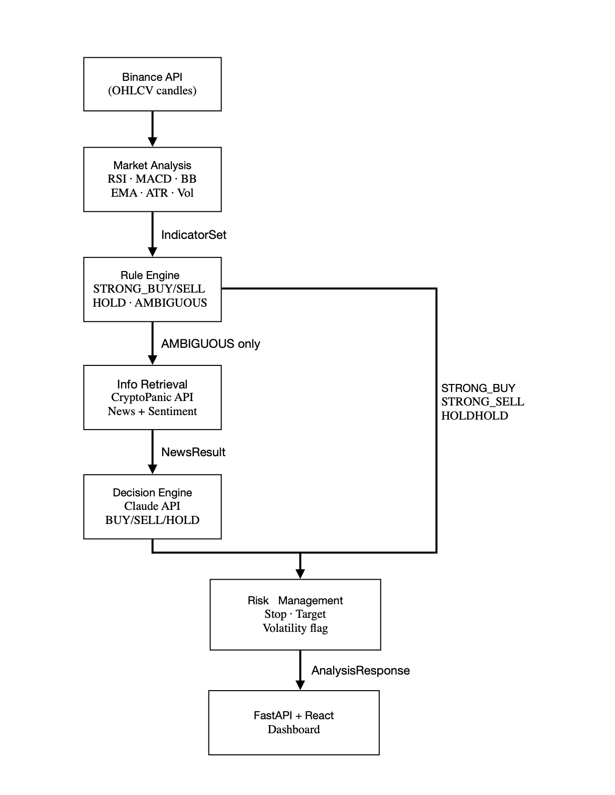

[](https://github.com/chamikaKity/agentic-trader/actions/workflows/ci.yml)
[](https://codecov.io/gh/chamikaKity/agentic-trader)
[](https://www.apache.org/licenses/LICENSE-2.0)

# Agentic AI Trading Signal System

A university assignment demonstrating a multi-module agentic pipeline for crypto trading signals. The system fetches live OHLCV data from Binance, computes technical indicators (RSI, MACD, Bollinger Bands, EMA, ATR), and applies a deterministic rule engine to classify signals as `STRONG_BUY`, `STRONG_SELL`, `HOLD`, or `AMBIGUOUS`. When the rule engine cannot resolve a signal, it optionally fetches news sentiment from CryptoPanic and calls the Claude API to produce a reasoned decision — keeping LLM usage targeted and cost-efficient. A final risk management module computes ATR-based stop-loss, take-profit, and risk/reward levels. Results are served via a FastAPI backend and displayed in a Vite/React frontend. No real trades are executed.

---

## Architecture



---

## Prerequisites

- **Python 3.11+**
- **uv** — fast Python package manager
  ```bash
  curl -LsSf https://astral.sh/uv/install.sh | sh
  ```
- **Node 18+**
- **VPN** if running from the UK (Binance geo-restricts UK IPs)

---

## Setup and Running

**1. Configure environment variables**

```bash
cp .env.example .env
# Edit .env and fill in:
#   ANTHROPIC_API_KEY=sk-ant-...
#   CRYPTOPANIC_API_KEY=...
```

**2. Backend**

```bash
uv sync
uv run uvicorn agentic_trader.main:app --reload
# API available at http://localhost:8000
```

**3. Frontend** (separate terminal)

```bash
cd frontend && npm install && npm run dev
# Open http://localhost:5173
```

**4. Tests**

```bash
uv run pytest
```

---

## How It Works

The pipeline runs five modules in sequence for each analysis request:

```
Market Analysis → Rule Engine → Information Retrieval → Decision Engine → Risk Management
```

| Module | Responsibility |
|---|---|
| **Market Analysis** | Fetches 200 candles from Binance and computes RSI, MACD, Bollinger Bands, EMA(20/50), and ATR(14) |
| **Rule Engine** | Applies deterministic thresholds to classify the signal as `STRONG_BUY`, `STRONG_SELL`, `HOLD`, or `AMBIGUOUS` |
| **Information Retrieval** | Fetches the top 5 news headlines from CryptoPanic and derives a sentiment score — called only for `AMBIGUOUS` signals |
| **Decision Engine** | Calls the Claude API with indicators and news context to resolve `AMBIGUOUS` signals — LLM is **not** called for clear signals |
| **Risk Management** | Computes ATR-based stop-loss, take-profit, and risk/reward ratio; flags high-volatility positions |

Every response includes an `agent_trace` field listing each module's output, making the agentic reasoning fully transparent.

---

## Known Limitations

- **Illustrative strategy** — signal thresholds are not optimised for profitability; this is a demonstration system
- **Binance geo-restriction** — the Binance public API is blocked in the UK; a VPN is required for local development
- **Community-based sentiment** — CryptoPanic sentiment scores are derived from community votes, not NLP analysis
- **Non-deterministic LLM decisions** — the same inputs may yield different Claude outputs across calls
- **No order execution** — the system generates signals only; no trades are placed
